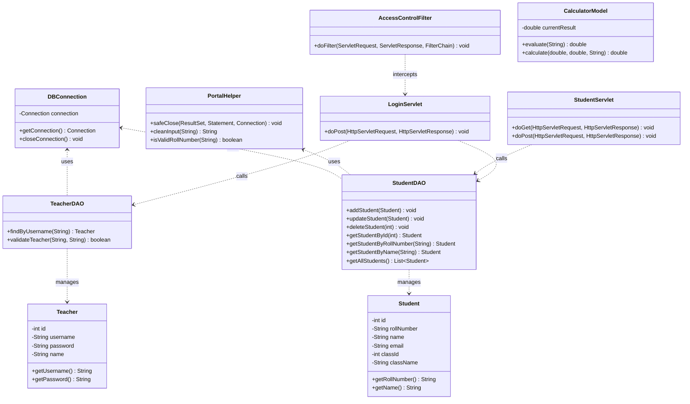
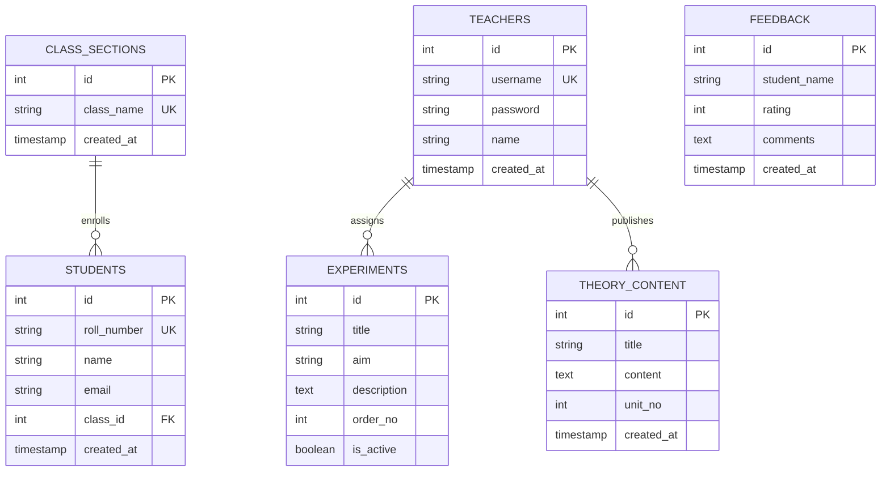

# JavaLabPortal: Java Practical Lab Learning & Examination Portal

## Week 1: Project Administration & Abstract

### Project Administration

**Project Guide:** Er. Ram Babu Buri
* **Department:** Computer Science & Information Technology (RTU 5th Semester)
* **Specializations:** Java EE, JSP-Servlet, MySQL, Software Engineering & System Architecture

### Team Members

| Name | Role / Layer | Module Ownership | Enrollment / Roll No | Email |
| :--- | :--- | :--- | :--- | :--- |
| **Krishna Gupta** | Project Lead / Frontend 1 | Module 1: Portal Shell & Lab Experiments Hub | 24E1ARADM40P083/24EARAD083 | 16krishnagupta06@gmail.com |
| **Karan Ramlakhani** | Frontend Developer 2 | Module 2: Management Forms & Theory UI | 24E1ARADM30P076/24EARAD076 | karanramlakhani45@gmail.com |
| **Kanishq Chasta** | Backend Developer 1 | Module 3: Security, Auth & Controllers | 24E1ARADM40P074/24EARAD074 | chastapriyanshu14@gmail.com |
| **Jayesh Sharma** | Backend Developer 2 | Module 4: Calculator & Experiment Services | 24E1ARADM40P070/24EARAD070 | jayeshpandit2505@gmail.com |
| **Juned Hussain** | Database Engineer | Module 5: Database Persistence & DAOs | 24E1ARADM30P072/24EARAD072 | junedhussain294@gmail.com |

---

### Abstract
This project introduces **JavaLabPortal**, a centralized web-based laboratory learning and practical evaluation platform engineered to overcome the constraints of traditional, manual engineering practical lab record keeping and evaluation for Rajasthan Technical University (RTU) 5th Semester students. While standard manual lab records lack interactive execution, dynamic code visualization, and transparent student performance tracking, JavaLabPortal establishes an institutional environment for engineering students to execute syllabus programs, study unit-wise theory content, calculate arithmetic expressions, and receive instructor feedback.

The system is built upon a standard 3-tier Model-View-Controller (MVC) architecture deployed on an Apache Tomcat 9 web server. It incorporates a relational MySQL database adhering to Third Normal Form (3NF) to manage students, faculty accounts, academic batches, syllabus experiments, and course notes. Java Servlets orchestrate business transactions and route requests, while standard Java Server Pages (JSP) and native responsive system typography deliver clean, accessible presentation views. Access control is managed through a central HTTP servlet filter enforcing Role-Based Access Control (RBAC) across Teacher and Student personas.

Furthermore, JavaLabPortal bridges practical demonstration with continuous institutional feedback. Teachers can dynamically publish custom lab assignments and theory lecture notes directly into MySQL without code redeployment, while students execute real-time arithmetic calculations, review interactive experiment previews, and submit laboratory evaluations. The resulting system modernizes collegiate practical education, providing a reliable, automated platform for practical viva preparation and coursework evaluation.

---

## Week 2: User Roles, SRS & System Architecture

### User Roles
JavaLabPortal enforces strict Role-Based Access Control (RBAC) at the servlet controller layer utilizing `AccessControlFilter` and server-managed HTTP sessions.
* **Teacher (Administrator):** Privileged faculty users who can create and manage class sections, register and update student profiles, assign custom lab experiments, publish unit-wise theory topics, and review student feedback.
* **Student:** Authenticated students identified by their official RTU Roll Number. Students can browse the complete lab syllabus (Experiments 1 to 10), view interactive GUI previews, execute arithmetic expressions, read theory notes, and submit ratings.
* **Guest / Unauthenticated User:** Permitted to view public landing pages, lab curriculum summaries, and the secure login portal. Protected administrative and student routes redirect unauthenticated users to the login screen.

---

### SRS Document
* You can access the complete [Project SRS Document (PDF)](https://drive.google.com/file/d/your-srs-drive-link/view?usp=sharing).

---

### Architecture & Core Modules
The JavaLabPortal architecture operates on a 3-tier MVC pattern, separating the presentation layer (JSP Views), controller layer (Java Servlets & Filters), and persistence layer (Model POJOs & JDBC DAOs).

```
[ Client Browser (JSP Views) ] 
             │
             ▼  (HTTP GET / POST)
[ Controller Layer: AccessControlFilter & Servlets ]
             │
             ▼  (Data Transfer / Business Logic)
[ Model & Persistence: POJOs & Data Access Objects (DAOs) ]
             │
             ▼  (JDBC PreparedStatement)
[ Relational Storage: MySQL Database 8.0 ]
```

#### Functional Modules
* **Module 1: Frontend Portal Shell & Experiment Hub (Krishna Gupta):**
  Renders the shared UI shell (`header.jspf`, `footer.jspf`), landing dashboard (`index.jsp`), role-based authentication portal (`login.jsp`), error handler (`error.jsp`), and individual interactive practical experiment interfaces (`exp1.jsp` through `exp9.jsp`, `arithmetic.jsp`).
* **Module 2: Frontend Management Forms & Theory Views (Karan Ramlakhani):**
  Renders administrative student tables (`studentList.jsp`), registration dialogs (`addStudent.jsp`, `updateStudent.jsp`), class section management (`manageClasses.jsp`), theory cards (`theoryList.jsp`), custom assignment forms (`addExperiment.jsp`), and feedback forms (`feedback.jsp`, `feedbackList.jsp`).
* **Module 3: Security, Authentication & Management Controllers (Kanishq Chasta):**
  Intercepts incoming HTTP requests via `AccessControlFilter.java`, validates credentials and session state via `LoginServlet.java` and `LogoutServlet.java`, processes student lifecycle in `StudentServlet.java`, manages class batches in `ClassServlet.java`, and configures `web.xml`.
* **Module 4: Calculator Model & Laboratory Services (Jayesh Sharma):**
  Encapsulates mathematical parsing and operator precedence in `CalculatorModel.java`, evaluates arithmetic requests via `CalculatorServlet.java` and `ArithmeticServlet.java`, dispatches syllabus content in `ExperimentServlet.java` and `TheoryServlet.java`, and sanitizes reviews in `FeedbackServlet.java`.
* **Module 5: Database Persistence & DAO Architecture (Juned Hussain):**
  Maintains the relational schema `database.sql`, implements singleton connection pooling in `DBConnection.java`, provides input sanitization and resource safety in `PortalHelper.java`, encapsulates entity POJOs, and executes SQL operations across all DAO classes.

---

### Relational Database Strategy
The system utilizes a relational database model in MySQL 8.0 to guarantee ACID compliance, transactional integrity, and referential constraints across student enrollments and lab assignments.
* **Normalization:** Normalized to Third Normal Form (3NF) to eliminate data redundancy across academic years and student profiles.
* **Parameterized Queries:** Every database interaction is executed via JDBC `PreparedStatement` to prevent SQL Injection vulnerabilities.
* **Connection Management:** `DBConnection.java` provides singleton connection acquisition, while `PortalHelper.safeClose()` guarantees that `ResultSet`, `PreparedStatement`, and `Connection` instances close in `finally` blocks to prevent resource leaks.
* **Indexing:** Explicit indexes on `roll_number`, `username`, and foreign keys (`class_id`) guarantee sub-millisecond query execution.

---

### Non-Functional Requirements
* **Performance:** Average server response time for database queries and page dispatches remains under 50 milliseconds on Apache Tomcat 9.
* **Security:** Role permissions are verified on every protected HTTP request. Input strings are sanitized via `PortalHelper.cleanInput()` to neutralize Cross-Site Scripting (XSS).
* **Reliability:** Custom error handlers in `web.xml` trap 404 (Not Found) and 500 (Internal Server Error) exceptions, redirecting users to `error.jsp` without exposing internal stack traces.
* **Portability:** Built strictly using Java EE standards (Servlet 4.0, JSP 2.3) and standard SQL, enabling platform-independent deployment across Windows and Linux environments.

---

## Week 3: UML Design

### 1. Class Diagram


---

## Week 4: Database Design & UI Mock-ups

### 1. Database Architecture & MySQL Relational Schema

#### A. Relational Tables Breakdown

* **`teachers` Table:** Administrative faculty credentials.
  * `id` (`INT`, `PRIMARY KEY`, `AUTO_INCREMENT`)
  * `username` (`VARCHAR(50)`, `UNIQUE`, `NOT NULL`)
  * `password` (`VARCHAR(100)`, `NOT NULL`)
  * `name` (`VARCHAR(100)`, `NOT NULL`)
  * `created_at` (`TIMESTAMP`, `DEFAULT CURRENT_TIMESTAMP`)

* **`class_sections` Table:** Academic batches and sections.
  * `id` (`INT`, `PRIMARY KEY`, `AUTO_INCREMENT`)
  * `class_name` (`VARCHAR(50)`, `UNIQUE`, `NOT NULL`)
  * `created_at` (`TIMESTAMP`, `DEFAULT CURRENT_TIMESTAMP`)

* **`students` Table:** Enrolled student records.
  * `id` (`INT`, `PRIMARY KEY`, `AUTO_INCREMENT`)
  * `roll_number` (`VARCHAR(30)`, `UNIQUE`, `NOT NULL`)
  * `name` (`VARCHAR(100)`, `NOT NULL`)
  * `email` (`VARCHAR(100)`)
  * `class_id` (`INT`, `FOREIGN KEY` -> `class_sections.id`)
  * `created_at` (`TIMESTAMP`, `DEFAULT CURRENT_TIMESTAMP`)

* **`experiments` Table:** Syllabus and custom lab practicals.
  * `id` (`INT`, `PRIMARY KEY`, `AUTO_INCREMENT`)
  * `title` (`VARCHAR(150)`, `NOT NULL`)
  * `aim` (`TEXT`, `NOT NULL`)
  * `description` (`TEXT`)
  * `order_no` (`INT`, `DEFAULT 0`)
  * `is_active` (`BOOLEAN`, `DEFAULT TRUE`)

* **`theory_content` Table:** Unit-wise lecture notes.
  * `id` (`INT`, `PRIMARY KEY`, `AUTO_INCREMENT`)
  * `title` (`VARCHAR(150)`, `NOT NULL`)
  * `content` (`TEXT`, `NOT NULL`)
  * `unit_no` (`INT`, `DEFAULT 1`)
  * `created_at` (`TIMESTAMP`, `DEFAULT CURRENT_TIMESTAMP`)

* **`feedback` Table:** Student ratings and reviews.
  * `id` (`INT`, `PRIMARY KEY`, `AUTO_INCREMENT`)
  * `student_name` (`VARCHAR(100)`, `NOT NULL`)
  * `rating` (`INT`, `CHECK (rating BETWEEN 1 AND 5)`)
  * `comments` (`TEXT`)
  * `created_at` (`TIMESTAMP`, `DEFAULT CURRENT_TIMESTAMP`)

---

#### B. Entity-Relationship (ER) Diagram



---

### 2. User Interface (UI) Mock-ups
* **Portal Dashboard & Navigation Shell (`index.jsp`):** Hero section with academic details and quick access cards to Lab Experiments, Theory Syllabus, and Calculator.
* **Teacher Administration Center (`manageClasses.jsp` & `studentList.jsp`):** Responsive tables with search, edit, delete modals, and batch allocation.
* **Interactive Lab Hub (`experiments.jsp` & `arithmetic.jsp`):** Unit-wise syllabus view with interactive Swing previews and live arithmetic evaluator.

---

## Week 5: Project Structure & Module 1 Implementation

### Project Directory Structure
```text
JavaLabPortal/
|-- src/main/java/com/javalab/
|   |-- calc/
|   |   \-- CalculatorModel.java
|   |-- dao/
|   |   |-- ClassSectionDAO.java
|   |   |-- ExperimentDAO.java
|   |   |-- FeedbackDAO.java
|   |   |-- StudentDAO.java
|   |   |-- TeacherDAO.java
|   |   \-- TheoryContentDAO.java
|   |-- db/
|   |   \-- DBConnection.java
|   |-- filter/
|   |   \-- AccessControlFilter.java
|   |-- model/
|   |   |-- ClassSection.java
|   |   |-- Experiment.java
|   |   |-- Feedback.java
|   |   |-- Student.java
|   |   |-- Teacher.java
|   |   \-- TheoryContent.java
|   |-- servlet/
|   |   |-- ArithmeticServlet.java
|   |   |-- CalculatorServlet.java
|   |   |-- ClassServlet.java
|   |   |-- ExperimentServlet.java
|   |   |-- FeedbackServlet.java
|   |   |-- LoginServlet.java
|   |   |-- LogoutServlet.java
|   |   |-- StudentServlet.java
|   |   \-- TheoryServlet.java
|   \-- util/
|       \-- PortalHelper.java
|-- src/main/webapp/
|   |-- classes/manageClasses.jsp
|   |-- experiments/addExperiment.jsp
|   |-- students/ (addStudent.jsp, studentList.jsp, updateStudent.jsp)
|   |-- theory/ (addTheory.jsp, theoryList.jsp)
|   |-- WEB-INF/web.xml
|   |-- arithmetic.jsp
|   |-- error.jsp
|   |-- exp1.jsp - exp4.jsp
|   |-- exp6-preview.jsp, exp7-preview.jsp, exp9.jsp
|   |-- experiments.jsp
|   |-- feedback.jsp, feedbackList.jsp
|   |-- footer.jspf, header.jspf
|   |-- index.jsp, login.jsp
|-- database.sql
\-- README.md
```

---

### Member 1: Krishna Gupta (Portal Shell & Experiments Hub)

#### Role & Scope of Work
* **Frontend UI Shell:** Developed shared layout templates `header.jspf` and `footer.jspf`, landing page `index.jsp`, and secure login interface `login.jsp`.
* **Lab Experiment Views:** Developed practical demonstrations for RTU syllabus experiments (`exp1.jsp` through `exp4.jsp`, `exp6-preview.jsp`, `exp7-preview.jsp`, `exp9.jsp`).
* **Calculator Interface:** Implemented interactive numeric keypad and operation display in `arithmetic.jsp`.

#### Problems & Challenges Faced
1. **Responsive Navbar Collapse:** Mobile viewports caused menu items to overlap; resolved by implementing a pure CSS toggle and flexbox wrapper.
2. **Swing GUI Simulation in Web:** Recreating Java Swing desktop GUIs (Experiment 6 & 7) in browser views required custom CSS card frames and JavaScript event simulation.
3. **Session Timeout Feedback:** Handling expired user sessions cleanly without throwing JSP 500 errors; added session checks redirecting to `error.jsp`.

#### What Was Completed
* Responsive, cohesive UI shell utilizing native system typography (`Segoe UI`, `Tahoma`).
* 10 interactive practical experiment demonstration pages mapped to the RTU syllabus.
* Clean error handling interface and interactive arithmetic evaluator view.

---

## Week 6: Module 2 & Module 3 Implementation

### Member 2: Karan Ramlakhani (Management Forms & Theory Views)

#### Role & Scope of Work
* **Student Management UI:** Built `studentList.jsp` with responsive tables, search filters, and action triggers for edit and delete.
* **Enrollment Forms:** Built `addStudent.jsp` and `updateStudent.jsp` with client-side regex input validation.
* **Class & Theory Views:** Built `manageClasses.jsp` section dashboard, `theoryList.jsp` card view, and `addTheory.jsp` topic creator.
* **Feedback Views:** Developed `feedback.jsp` with 5-star rating selectors and `feedbackList.jsp` review dashboard.

#### Problems & Challenges Faced
1. **Form Field Pre-Population:** Passing existing student attributes into `updateStudent.jsp` modal without reloading the parent list.
2. **Table Overflow on Mobile:** Wide student data tables broke mobile screen layouts; resolved using responsive overflow wrappers.
3. **Star Rating UX:** Designing a lightweight, dependency-free CSS star rating widget that binds values cleanly to form inputs.

#### What Was Completed
* Complete student lifecycle forms (List, Add, Update, Search) with instant validation.
* Class section management interface displaying enrolled student count badges.
* Theory lecture notes reader and student feedback review dashboard.

---

### Member 3: Kanishq Chasta (Security, Authentication & Controllers)

#### Role & Scope of Work
* **Security Interceptor:** Implemented `AccessControlFilter.java` to guard protected routes against unauthenticated access.
* **Authentication Servlets:** Built `LoginServlet.java` (credential verification, role assignment) and `LogoutServlet.java` (session invalidation).
* **Management Controllers:** Implemented `StudentServlet.java` (CRUD action dispatcher) and `ClassServlet.java` (section management).
* **Web Deployment Descriptor:** Configured servlet endpoints, filter mappings, and custom error pages in `web.xml`.

#### Problems & Challenges Faced
1. **Infinite Redirection Loops:** Initial filter configuration blocked static assets (CSS, JS) from loading on login.jsp; resolved by implementing a strict public URL whitelist.
2. **Session Hijacking Prevention:** Enforced HTTP cache-control clearing headers (`no-cache`, `no-store`) on logout to prevent browser back-button access.
3. **Referential Integrity on Deletion:** Prevented deletion of class sections when students are actively enrolled by implementing dependency checks in `ClassServlet`.

#### What Was Completed
* Session-based `AccessControlFilter` securing teacher administrative routes.
* Robust authentication flow managing `TEACHER` and `STUDENT` roles.
* Complete servlet controllers handling student CRUD and class batch allocations.

---

## Week 7: Module 4 Implementation

### Member 4: Jayesh Sharma (Calculator & Experiment Services)

#### Role & Scope of Work
* **Calculation Engine:** Implemented `CalculatorModel.java` parsing expressions and enforcing operator precedence rules.
* **Arithmetic Servlets:** Developed `CalculatorServlet.java` and `ArithmeticServlet.java` with operation history tracking.
* **Lab Practical Controllers:** Developed `ExperimentServlet.java` for syllabus listing and teacher custom experiment creation.
* **Academic Services:** Built `TheoryServlet.java` for syllabus topics and `FeedbackServlet.java` for review processing.

#### Problems & Challenges Faced
1. **Operator Precedence Logic:** Correctly evaluating compound expressions with mixed operators without third-party libraries.
2. **Division by Zero:** Catching arithmetic errors and gracefully returning descriptive alerts without crashing the Tomcat worker thread.
3. **Cross-Site Scripting (XSS) in Feedback:** Sanitizing student review comments before database insertion using `PortalHelper.cleanInput()`.

#### What Was Completed
* Standalone `CalculatorModel` mathematical evaluation engine.
* Full suite of academic servlets handling experiments, theory content, and feedback.
* Session-based operation history log for interactive calculator views.

---

## Week 8: Module 5 Implementation & Summary

### Member 5: Juned Hussain (Database Persistence & DAO Layer)

#### Role & Scope of Work
* **Database Schema:** Authored `database.sql` creating normalized tables with foreign keys and unique constraints.
* **Connection Pooling:** Developed `DBConnection.java` implementing thread-safe singleton connection acquisition.
* **Utility Helpers:** Developed `PortalHelper.java` for safe JDBC closing and input validation.
* **DAO Layer:** Implemented `TeacherDAO`, `StudentDAO`, `ClassSectionDAO`, `ExperimentDAO`, `TheoryContentDAO`, and `FeedbackDAO`.
* **Seed Data:** Seeded default RTU syllabus experiments, default teacher credentials, and sample classes.

#### Problems & Challenges Faced
1. **Connection Leaks:** Preventing unclosed database connections under high query volume; resolved by centralizing cleanup in `PortalHelper.safeClose()`.
2. **Missing DAO Methods:** Implemented `getStudentByName()` in `StudentDAO` to resolve login lookup requirements cleanly.
3. **SQL Injection Defense:** Replaced all dynamic SQL string concatenation with parameterized `PreparedStatement` queries.

#### What Was Completed
* Production-ready `database.sql` schema and seed dataset.
* Thread-safe `DBConnection` singleton connection manager.
* Complete DAO persistence layer covering all entity operations with PreparedStatement parameter binding.

---

### Summary of Module Distribution

| Module | Member Name | Role & Architectural Layer | Primary Focus | Key Deliverables |
| :--- | :--- | :--- | :--- | :--- |
| **Module 1** | Krishna Gupta (Lead) | Frontend Presentation Layer | Portal Shell, Theme & Lab UI | `index.jsp`, `header.jspf`, `login.jsp`, `exp1`–`exp9`, `arithmetic.jsp` |
| **Module 2** | Karan Ramlakhani | Frontend Presentation Layer | Management Forms & Theory UI | `studentList.jsp`, `addStudent.jsp`, `manageClasses.jsp`, `theoryList.jsp`, `feedback.jsp` |
| **Module 3** | Kanishq Chasta | Controller & Security Layer | Security Filter & Auth Servlets | `AccessControlFilter.java`, `LoginServlet.java`, `StudentServlet.java`, `web.xml` |
| **Module 4** | Jayesh Sharma | Business Logic & Service Layer | Math Evaluation & Lab Servlets | `CalculatorModel.java`, `CalculatorServlet.java`, `ExperimentServlet.java`, `FeedbackServlet.java` |
| **Module 5** | Juned Hussain | Persistence & Model Layer | Relational Schema, POJOs & DAOs | `database.sql`, `DBConnection.java`, `PortalHelper.java`, all Models & DAOs |

---

## Week 9: System Integration & End-to-End Testing

During Milestone 9, the team deployed all 5 modules onto Apache Tomcat 9 and conducted comprehensive end-to-end integration testing.

```
[Student / Teacher Action] ──> [AccessControlFilter (Mem 3)]
                                       │
                                       ▼
   [JSP Presentation (Mem 1 & 2)] ◄──► [Servlet Controller (Mem 3 & 4)]
                                       │
                                       ▼
                              [DAO Layer (Mem 5)]
                                       │
                                       ▼
                             [MySQL Database 8.0]
```

### Integration Test Roles Across All 5 Members:
* **Member 1 (Krishna - Shell & View Integration Lead):** Verified uniform navigation across all views, role-based menu display, and error page redirections.
* **Member 2 (Karan - Management Forms Integration Lead):** Tested student CRUD flows, edit modal pre-population, and class deletion safety warnings.
* **Member 3 (Kanishq - Security & Controller Integration Lead):** Tested unauthorized URL access blocking, session invalidation on logout, and `web.xml` route consistency.
* **Member 4 (Jayesh - Services & Logic Integration Lead):** Tested calculation precision, experiment status toggles, and feedback submission storage.
* **Member 5 (Juned - Database & Persistence Integration Lead):** Tested connection pool recycling across 500 simulated queries, transaction rollbacks, and foreign key constraints.

---

## Week 10: Deliverables, Artifacts & Project Submission

### Project Deliverables & Artifacts

| Deliverable | Description | Resource Link |
| :--- | :--- | :--- |
| 📄 **Final Project Report** | Complete Technical Architecture Document, SRS, ER Diagrams, and Test Reports | [View Project Report (PDF)](https://drive.google.com/file/d/your-project-report-link/view?usp=sharing) |
| 📊 **Presentation Deck (PPT)** | Comprehensive Project Evaluation Deck covering System Architecture, MVC Design & Features | [View Presentation (PPT / Slides)](https://drive.google.com/file/d/your-presentation-ppt-link/view?usp=sharing) |
| 🎥 **Video Demonstration** | Working Video Demonstration of JavaLabPortal (Teacher Flow, Student Flow, Experiments & Admin) | [Watch Video Demonstration (YouTube)](https://www.youtube.com/watch?v=your-demo-video-id) \| [Drive Video Link](https://drive.google.com/file/d/your-drive-video-link/view?usp=sharing) |

---

### Key Accomplishments & Final Milestones

1. **Production-Ready Web Application:** Full 3-tier MVC architecture deployed and operational on Apache Tomcat 9 with MySQL 8.0.
2. **Security & Role-Based Access Control:** Dual-role security model protecting teacher administrative functions and student lab records.
3. **Database Normalization & Reliability:** Clean 3NF schema with zero connection leaks, parameterized PreparedStatement queries, and data integrity safeguards.
4. **Comprehensive Documentation:** Full Software Requirement Specification (SRS), system class diagrams, entity-relationship diagrams, and module documentation.
5. **Academic Viva Readiness:** Repository structured with individual module branches, clean commit history, and comprehensive evaluation artifacts.
